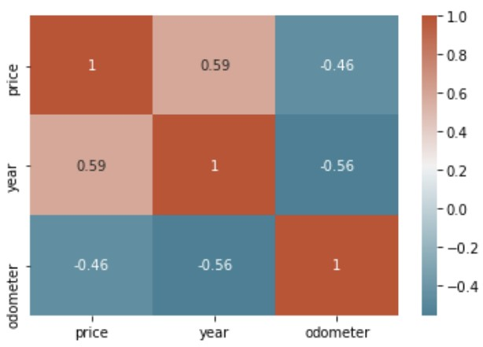

### CIND-820
# Predicting The Price Range Of Used Cars

## Description
During the pandemic, there was a noticeable increase in the price of used cars with some selling for more money than new cars. This was mainly due to the shortages in new cars which was driven by a global semiconductor shortage. People were less willing to suffer through the long wait times to get a new car and it was difficult to find the models they liked in the car lot. Thus, the demand for used cars steadily increased ergo the price. 

Because of this, I wanted to make a machine learning model that could predict the price range of a used car. This model can be used by car sellers to determine the possible price for the car they are selling. This can also be used by car buyers to determine if the price of the car they want to buy is within the the fair market value. This model will be trained  and tested using pre-pandemic data. The tested model will then be used on pandemic data to see whether there has been a degradation in performance. If there is any decline in the performance, this would mean that there is a dataset shift in the pandemic data. A dataset shift could signal that used cars are indeed priced differently during the pandemic compared to pre-pandemic data. 

## Objectives
- Train a model to predict the price range of used cars using pre-pandemic data. 
- Use 3 algorithms to train the model: XGBoost, Random Forest, and Neural Networks
- Evaluate which model performs the best
- Use the best-performing model on pandemic data
- Determine any dataset shift

## Tools
Python was used for this project. The following libraries were utilized:
- Numpy
- Pandas
- Matplotlib
- seaborn
- XGBoost
- scikit-learn
- Keras

## Steps
1) Data cleaning and preprocessing
2) Exploratory Data Analysis 
3) Train-test split 
4) Modelling:  
    a) XGboost  
    b) Random Forest  
    c) Neural Networks  
5) Comparison of model performance 
6) Conclusion 

## The Data
The dataset to be used was taken from Kaggle.com. The used cars dataset was first scraped in 2018 from Craigslist. It is updated every few months with the latest data. The dataset was split into pre-pandemic and pandemic datasets. There are 23 variables in the dataset before any preprocessing and cleaning. It has 1,961,218 samples with 1,076,152 pre-pandemic data and 885,066 data during the pandemic.

## Data Cleaning and Preprocessing
Steps taken to clean the data included remove unnecessary columns, remove samples wiht missing values, and remove outliers among others. The final dataset after preprocessing and cleaning contained 194,861 rows. All the variables were categorical except for price and mileage (odometer) which were converted to price range and mileage range, respectively. The 14 independent variables were one-hot encoded into 884 independent variables.

## EDA
The exploratory data analysis was done with target questions in mind. Some of the insights learned are shown below.

#### Correlation
There is a direct correlation between price and year. The more higher (more recent) the year, the higher the price of the used car since it is relatively newer. On the other hand, there is an indirect correlation between price and odometer. The higher the odometer reading, the lower the price of the car. This because the odometer reading reflects how much the car has been used. This translates to the amount of wear and tear the car has endured. The more the car has been used, the lower the price. 

  

## Modelling

  Preprocessing: Data cleaning and one-hot encoding of categorical variables

  EDA: Exploratory data analysis to get a general understanding of the data and visualize the data as well as the relationships of the different variables. 

  Train Test Split: Split the data into pandemic data and prepandemic data. The prepandemic data will be used to train the models. The prepandemic data is split into train and test. 

  XGboost: Model trained using XGBoost. The model had an F1-score of 67.60% using the prepandemic data. The performance went down to 54.72% when the model was used on the pandemic dataset. 

  Random Forest: Model trained using random forest. The model had an F1-score of 76.13% using the prepandemic data. The performance went down to 0.53.58% when the model was used on the pandemic dataset.
  
  Neural Networks: Model trained using neural networks. The model had an F1-score of 76.60% using the prepandemic data. The performance went down to 59.39% when the model was used on the pandemcid dataset.
  
  Retrained Neural Networks: The neural networks model was retrained with the combined pre-pandemic and pandemic dataset. The model had an F1-score of 74.71%. 

