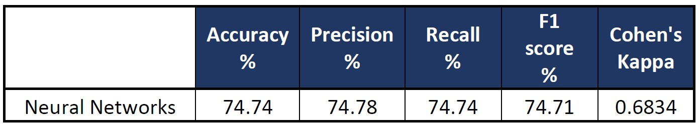

### CIND-820
# Predicting The Price Range Of Used Cars

## Description
During the pandemic, there was a noticeable increase in the price of used cars with some selling for more money than new cars. This was mainly due to the shortages in new cars which was driven by a global semiconductor shortage. People were less willing to suffer through the long wait times to get a new car and it was difficult to find the models they liked in the car lot. Thus, the demand for used cars steadily increased ergo the price. 

Because of this, I wanted to make a machine learning model that could predict the price range of a used car. This model can be used by car sellers to determine the possible price for the car they are selling. This can also be used by car buyers to determine if the price of the car they want to buy is within the the fair market value. This model will be trained  and tested using pre-pandemic data. The tested model will then be used on pandemic data to see whether there has been a degradation in performance. If there is any decline in the performance, this would mean that there is a dataset shift in the pandemic data. A dataset shift could signal that used cars are indeed priced differently during the pandemic compared to pre-pandemic data. 

## Objectives
- Train a model to predict the price range of used cars using pre-pandemic data. 
- Use 3 algorithms to train the model: XGBoost, Random Forest, and Neural Networks
- Evaluate which model performs the best
- Use the best-performing model on pandemic data
- Determine any dataset shift

## Tools
Python was used for this project. The following libraries were utilized:
- Numpy
- Pandas
- Matplotlib
- seaborn
- XGBoost
- scikit-learn
- Keras

## Steps
1) Data cleaning and preprocessing
2) Exploratory Data Analysis 
3) Train-test split 
4) Modelling:  
    a) XGboost  
    b) Random Forest  
    c) Neural Networks  
5) Comparison of model performance 
6) Conclusion 

## The Data
The dataset to be used was taken from Kaggle.com. The used cars dataset was first scraped in 2018 from Craigslist. It is updated every few months with the latest data. The dataset was split into pre-pandemic and pandemic datasets. There are 23 variables in the dataset before any preprocessing and cleaning. It has 1,961,218 samples with 1,076,152 pre-pandemic data and 885,066 data during the pandemic.

## Data Cleaning and Preprocessing
Steps taken to clean the data included remove unnecessary columns, remove samples wiht missing values, and remove outliers among others. The final dataset after preprocessing and cleaning contained 194,861 rows. All the variables were categorical except for price and mileage (odometer) which were converted to price range and mileage range, respectively. The 14 independent variables were one-hot encoded into 884 independent variables.

## EDA
The exploratory data analysis was done with target questions in mind. Some of the insights learned are shown below.

#### Correlation
There is a direct correlation between price and year. The more higher (more recent) the year, the higher the price of the used car since it is relatively newer. On the other hand, there is an indirect correlation between price and odometer. The higher the odometer reading, the lower the price of the car. This because the odometer reading reflects how much the car has been used. This translates to the amount of wear and tear the car has endured. The more the car has been used, the lower the price. 

  

This relationship between price to year and price to odometer was also visible in the scatterplots below. 

  
  

#### Price Distribution
A frequency distribution of the prices was prepared, and it showed that the distribution is skewed to the right with a mean of $12,277 and median of $8,995. Majority of the used cars being sold have prices below $20,000.

  

## Modelling & Evaluation
The three models used were trained with 70% of the pre-pandemic data and then tested using the remaining 30% of the pre-pandemic data. The results were then compared using accuracy, precision, recall, F1 score, and Cohen’s Kappa as criteria. 

**Accuracy** is the ratio of correctly predicted observations to the total observations. 
**Precision** is the ratio of correctly predicted positive observations to the total predicted positive observations. Recall is the ratio of correctly predicted positive observations to the total actual positive observations. 
**F1-score** is the weighted average of precision and recall. 
**Cohen’s kappa** measures the proximity of the predicted classes to the actual classes when compared to a random classification. It is one of the best metrics for evaluating multi-class classifiers trained on unbalance datasets. The out put is normalized from 0 to 1. The closer the score is to 1, the better the classifier.

Evaluation focused mainly on F1 score and Cohen’s Kappa as they are more reliable measures of multi-class classification problems.

The table below summarizes the performance of the 3 models trained. Neural Networks had the best performance with an F1 score of 76.60 and a Cohen kappa of 0.7064.

  

These models were then used on the pandemic dataset. Their performance is summarized in the table below. As we can see, their performance declined. 

  

The decline in their performance is summarized in the following table. Random forest had the greatest decline at 30%. 

  

This decline in performance in all the models indicate that there has been a dataset shift. Dataset shift occurs when there is a change in the distribution of data. This may have been caused by change of environments.

There are various ways of addressing this dataset shift. For this paper, we will only employ model retraining. Since neural network had the best classification performance, it was selected the model for retraining. The model was retrained using the combined dataset with not distinction between pandemic and pre-pandemic data. The same split was used to get training set and the test set. The retrained model had an F1-score of 74.71% and Cohen’s kappa coefficient of 0.6834. These results are better than that of the model trained solely on pre-pandemic data. 

  

## Conclusion
3 models were trained to predict the price range of used cars: XGBoost, Random Forest, and Neural Networks.

Neural Networks performed the best with an F1 score of 76.60 and Cohen kappa score of 0.7064. This means that the model performs well in predicting the price range of used cars. 

When used on the pandemic dataset, the model's performance declined indicating a dataset shift. 

Model retraining was employed to address the dataset shift. 

